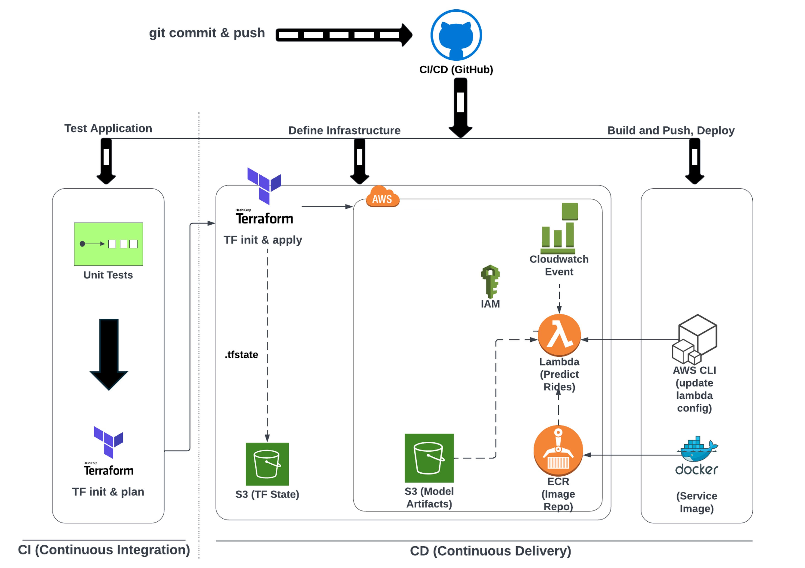

# Mobile Price Classification (Multi-class Classification Machine Learning)
The objective of this ML github project is to showcase the **end-to-end pipeline of multiclass machine learning classification problem** from data ingestion to data preprocessing to feature engineering to model comparison to hyperparameter tuning and eventually inferencing/predicting. Additionally, **some mlops tools have been experimented with to demostrate capabilities** such as model experiment tracking (MLFlow), orchrestration (Prefect), flask server, model result monitoring (Evidently) and dashboarding (Grafana).


## Setting up of the environments and the various ML tools
1. Create a clean/fresh conda environment with python environment 3.9
```
conda create -n env_name python=3.9 anaconda
```

2. Activate the conda environment and install pip in conda env
```
conda install pip
conda activate env_name
```
"
3. Install the required frameworks/libraries from the requirements.txt using pip

4. Activate the prefect server before MLFlow
```
prefect server start
```

5. Activate MLFlow to view the dashboard
```
mlflow ui
```

6. Activate Flask Web Server and use predict_api.py to test the predict.py flask server
```
cd src
python predict.py
python predict_api.py
```

7. Docker compose up the grafana dashboard, database for storing of metrics, evidently for calculation of the metrics
```
cd ..
docker compose build
docker compose up / docker compose up --build
```

## Scoring Metric Choice
**Accuracy is used as the choice of evaluation metric** as from EDA, it can be observed that the **price_range target labels are well balanced.** The model evaluated using accuracy should generalise well to test dataset, provided that the distribution of the test dataset is similar to the train dataset, though this is regardless of the model. 

## Exploratory Data Analysis + Data Preprocessing + Modelling Approaches 
**Exploratory Data Analysis** is performed to gain a better understanding of the data so that **better insights and decision-making, such as removal of columns, understanding of columns, feature engineering of new, and checking of missing values percentage can all be performed.**

1. **Data Preprocessing**
a.   **Remove redundant features such as “Unnamed: 0” since from domain knowledge**, unique identifiers do not provide signals or aid in the predictive performance of the machine learning models.

b. **Creation of new variables (Feature Engineering) – “old” feature.** First, using domain knowledge, a **set of features that new phones will possess are – wifi, Bluetooth, dual_sim, 4G and touch_screen.** As such, phones that do not possess any one of these features are considered as “old” phone model. It is not required to create a “new” feature as it will be a linear combination of the “old” feature, which will increase the number of feature, while having a high redundancy of providing the same information as the new (new = 1 – old)

c. **Creation of new variables to model non-linearity (spline transformation).** From EDA, it is observed that price_range has a non-linear distribution across “Ram” variable. **Furthermore, the distributions across price_range greatly differ among each categories across the ram feature, allowing ml models to better classify and separate the price_range categories.** Histograms/Binning was used to check for non-linearity, but it is not advisable as binning leads to a loss of information and the cut-offs are arbitrary. Instead, **spline** was used to model non-linearity.

d. **Missing Values were handled by multiple imputation** as introducing mean or mode imputation can distort the model distribution, and it is not best practice. However, it is done in fold to prevent data leakage or over-optimistic results from being reported, contributing to a slightly longer latency. Complete-case analysis was not chosen as it will remove rows completely, reducing the number of samples used for training.

e. **Multicollinearity check was not performed as the primary objective of the model and task is to best predict the price_range.**  Perfect multicollinearity would however be an issue as it introduces variables without providing more signals or information to the model. As such, the “new” phone model variable was not introduced together with the “old” phone models variable. Otherwise, the original features in the excel sheet do not seem to be a linear combination of each other.

2.  **Modelling & Model Comparison**
a.	**Cross validation with shuffling was used** to prevent machine learning models from learning any ordering. **Random seed was used for consistency** and comparison, otherwise the performance will fluctuate.

b.	**XGBoost Classifier was used as a baseline as it provides a good performance without any tuning and can handle missing values without imputation.** A high bar was thought to be better as otherwise it may lead to overtly optimistic results when the baseline model used has lower performance benchmark.

c.	**Iterative improvements were added to the baseline model to check if the model performance can be improved.**
i.	Adding new features together with multiple imputation  had higher score than the baseline, suggesting that they do indeed provide better signals to the model and improve predictive performance
ii.	Spline transformation reduced validation accuracy in both the baseline (XGBoost) and final selected model SVM. It was hence not introduced to the final model fitting
iii.	Comparison across the models were then performed from non-tree base models to tree-based models. **Surprisingly, non-tree based models, such as KNN and SVM radial performed better than the trees based models.** SVM was selected as the final fitted model since it has the highest validation accuracy with the least overfitting as shown from the mean train acc and mean val accuracy.
iv.	**SVM performed best with the feature engineered “old” phone model variable**, compared to using the original datasets or the spline transformation. **Standardized (standard scalar) has been trialled as SVM uses distance metrics to classify and having a standardized feature set after imputation and before the model should be better.** Surprisingly, the model works poorer under these conditions and was as such, these were not adopted.
v.	Grid search hyperparameter search was implemented as it was thought there is slight overfitting from the results.csv file. However, the param of C = 1.1 provided the best score, which indicates that lower regularisation instead provided better validation accuracy. Hence, perhaps the overfitting is considered insignificant

## MLOps tools
Various tools were experiemnted with to demostrate as well as simulate production like machine learning projects in MLOps. Though it is not a full-fledge mlops project and more tools could be considered, this is an endeavour at least in part to strive towards that production like experimentation with industry ml projects.



**AWS Cloud Services**
AWS EC2 Instance for persistence of MLFlow experiment tracking. AWS S3 to store ML/DL/LLM model artifact. AWS ECR for storing docker image. AWS Lambda for function invocation. 

**Terraform**
Terraform as an IAC to spin up the respective AWS resources and modules, allowing for greater automation in creating resources

**Github Action**
Terraform as an IAC to spin up the respective AWS resources and modules, allowing for greater automation in creating resources

**Flask Server**
Start the flask web server from predict.py and call the API endpoint from predict.py. Flask was chosen as it is mature and well tested, allowing for calls between the frontend and backend.

**MLFlow**
MLFlow is used for experimentation tracking and allows for better logging of the various metrics. Models could even be hosted on the model registry with various stages such as staging and production. It even allows models to be hosted on AWS S3, allowing for persistence of storing the model.

**Prefect**
Prefect is a simple and easy to use orchrestration tool that is intuitive as compared to other tools, though this may be subject to individual preference as well as the team's choice.

**Evidently and Grafana**
Evidently and Grafana allows for easy monitoring of the model performance and early detection of model drift.

